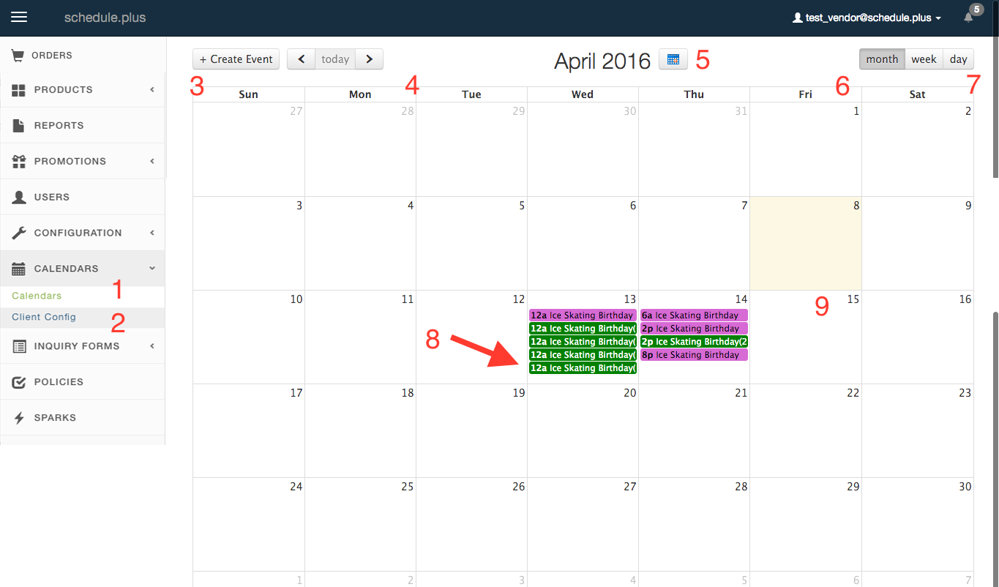
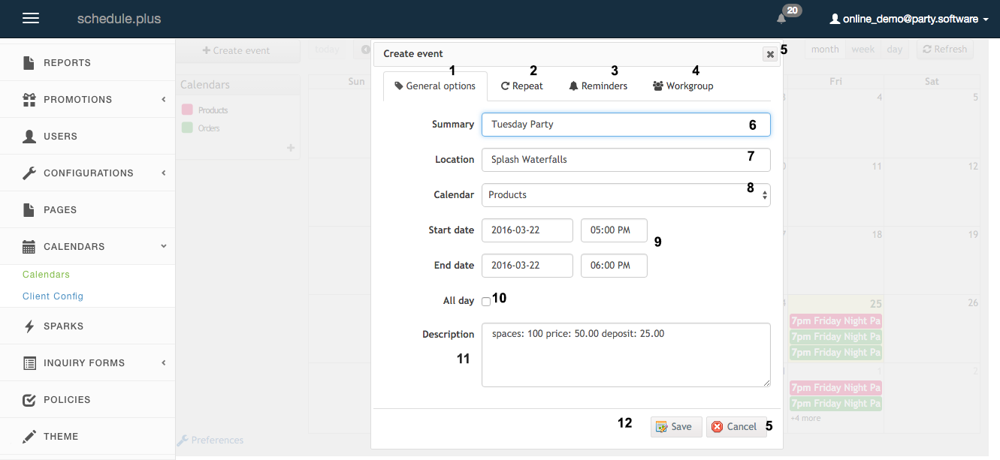
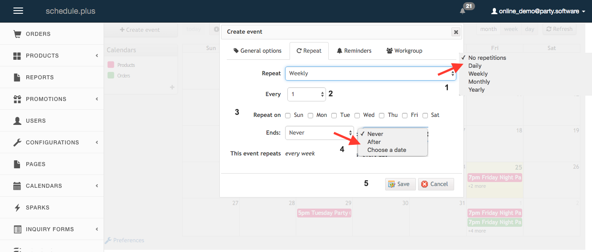

# Navigating Calendar Events

**Accessing the Calendar:**

  

In the navigation bar expand promotions - click through to calendar **(1)** in menu.  
The picture shown is of the Calendar page. The calendar will be blank if events have not been created.  
Alternative months can be viewed by clicking the arrows **(4)** or the month icon for a drop down menu **(5)**  
Calendar view can be changed using the options show in field **(6)**  
To begin creating an event click **(3)** or any date on the calendar **(9)** and follow instructions in the next picture.  
If you have selected field **(7)** click and drag the mouse over time slots which are needed for the event time.  
To modify an existing event select the event from the calendar screen **(8)**.

**_When an event is modified through calendar it will over-write all existing stock quantities.  
This includes events which have altered stock availability, repeats, or times, and have been purchased.  
Before modifying an event through the Calendar, check your orders - to make changes without affecting existing orders on an event choose a date beyond the furthest purchased event._**  

**Creating a Calendar Event:**  

  

Click +Create Event using instructions above.    
When the screen first loads all fields will be blank.  
The text that appears here is entered as an example.  

**Instructions for creating an Event Product:**  
In the field labeled **(6)** enter a title for your event - Tuesday Party is an example.  
Enter a location in field **(7)**, you can leave this blank if you prefer.  
Calendar must remain set to Products in field **(8)** to create an event.  
Use the fields Start Date and End Date **(9** to set a date and time for your event.  
If event is all day check **10**  
In the Description field **(11)**, the keywords: spaces, deposit and price can be used (see text below for details).  
Save event **(12)** after making changes.  

**Keyword functions for Description field (11)**:  
**spaces: 100** - spaces is the stock/quantity, 100 is the variable of this - this variable is yours to choose.  
Spaces creates stock movements (be that available spaces, or a count of people - you name this quantity later).  
This is shown in variant as an editable field, but this is not editable through anything by calendar or inidually through stock.  
**_When an event is modified through calendar it will over-write and modify all existing stock quantities.  
This includes events which have altered stock availability through purchasing_**  
**price: 50.00** - this is a $50.00 price for this Event Product.  
Price is a keyword that creates a price which is visible within the Event Product.  
**deposit: 25.00** - deposit is the deposit price for the event, in this case that cost is $25.00.  
Deposit is a keyword that creates a customer deposit for the Event Product.  

  
**Overview of Features in Create Event:**  

1.  Tab to access General Options - Title, Description, Time and Date Fields.  
2.  Tab to access Repeat features - by rules of occances; dates; day of the   week, month, year; ect.  
3.  Tab to access Reminders feature for sync with ICal and Google Calendar.  
4.  Tab to Sync calendar with others to form a Workgroup.  
5.  Click this field to cancel creation of event.  
6.  Title Field for event; Set event name here.  
7.  Location Field: name your event location.  
8a.  All events are considered Products and are placed in the Products calendar.  
8b.The Orders calendar auto-populates as customers place orders.  
9.  Use time and date options to set start time and length of event.  
10.  All Day checkbox takes away time settings and forces an all day event when checked.  
11.  This field is used with keywords spaces / price / deposit to alter event.  
12.  Save event - Click this before moving on.  

**Repeat Features:**

1.  Drop down menu to select rule of repetition: No repetitions is default - event will not repeat:  
Daily - event will repeat daily on selected days.   
Weekly - event will repeat weekly on selected days.    
Monthly - event will repeat on date every selected amount of months.    
Yearly - event will repeat on date every selected amount of years.  
2.  Field to select frequency or repetition: 1 = 1 per repeat rule, 2 is equivilent to bi-weekly, bi-monthly, bi-yearly, ect.  
3.  Field to select days - relevant to Daily and Weekly repeat rules.  
4.  Ends: this field sets the end of your repeat rule.    
    Never: Event will be populated for three months in advance, and will  continue to repopulate as dates shift forward - until or unless it is changed or editted.   
    After: The event will be populated until it has occurred the amount x amount of times - you select this amount from this options menu. Choose a date:  Event will be populated until the date that you select from this options menu.  

