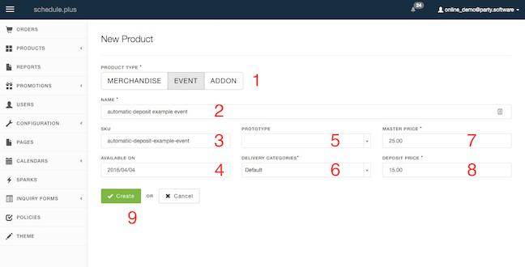

# Creating a Product with Deposit

This example will create an event product with an auto-generated deposit.  
For more details on creating an event product, see Creating an Event Product.
 
# Creating a Product with Deposit:

  

**(1)** Choose what type of product you are creating. This example will create an Event Product.  
**(2)** Choose your product name.  
**(3)** A SKU will be generated by the product name. This field can be editted, but must not include spaces.  
**(7)** Enter a Price for the event. The example is $25.00.  
**(8) _Deposit price field. If left blank when a product is created a deposit promotion will not be auto-generated for the event and all variants of the event._**  
**(9)** Click Create once you have filled out the above fields (at minimum).  

 

#Creating a Product with Deposit Continued:

  
Fields **(1)**, **(2)**, **(4)**, **(5)**, and **(8)** have carried over from selections in the Creating a Product with Deposits.  
Fill in field **(13)** to create spaces for this event.  
Click Create **(23)** to save changes.  

 
 
#Creating a New Variant for an Event Product with a Deposit: 

**(1)** Select product type: Event.  
**(2)** Enter a SKU without spaces.  
**(3)** Select a start and end date / time.
**(4)** Use these fields if there is shipping or size information on the event product.  
**(5)** Spaces creates an available amount of orderable spaces within the event variant - these can be reflected as people, seats, or products.  
**(6)** Use the Minimum and Maximum Occupacy fields as nessecary.  
**(7)** and **(8)** have been carried over from our master variant. If the Master Variant was not created with a deposit, this information can be entered here and individually within each variant of this event product.  
**(9)** Cost price reflects the cost of the event for the admin, this is not shown to the customer.  
**(11)** Create when you have finalized your choices.  

 

#Variants in the Product Field:

  
When viewing Variants page there is a field which shows deposit price in list view.

